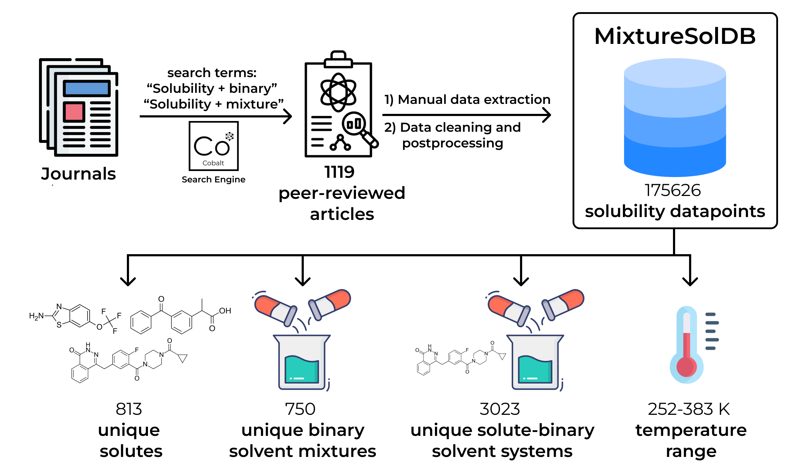

    

BigSolDB 2.0 contains 103944 experimentally measured solubility values of 1448 organic compounds in 213 solvents reported in the 1595 literature peer-reviewed articles.

Visit our demo <https://mixturesoldb.streamlit.app/>.

Download MixtureSolDB: .