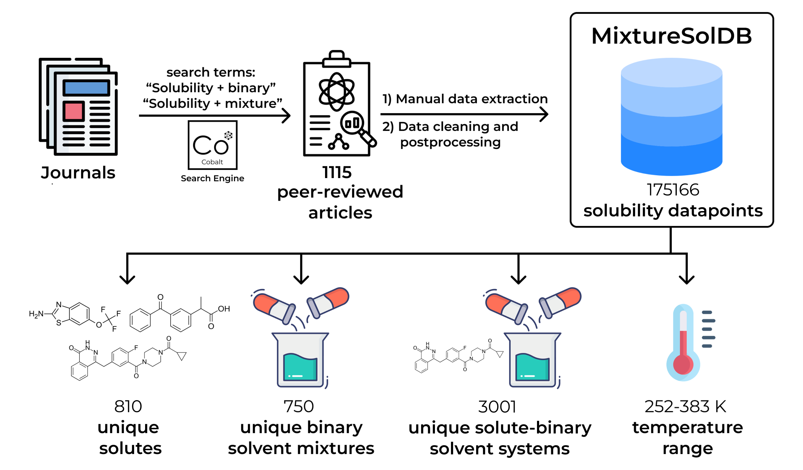

    

MixtureSolDB contains 175166 experimental solubility values within a temperature range from 252 to 383 K for 810 organic compounds as well as 3018 unique solute-binary solvent systems as well as 750 unique binary solvent mixtures extracted from 1115 peer-reviewed articles.

Visit our demo <https://mixturesoldb.streamlit.app/>.

Download MixtureSolDB: .